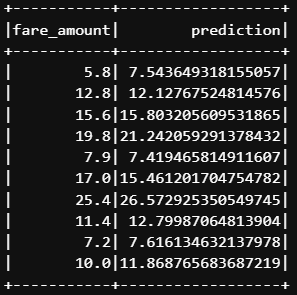

# NYC Taxi Fare Prediction Using Pyspark 🚖

## Project Overview
This project analyzes **NYC Yellow Taxi data** spanning **13.2M records** across four months (June, July, August, and September). The primary goal was to familiarize myself with **PySpark** and **big data handling**. Through this project, I conducted **exploratory data analysis (EDA)**, implemented **feature engineering**, and built **machine learning models** for fare prediction. The project also included visualizations and insights derived from this massive dataset.

## Dataset 📂
- **Source**: [NYC Yellow Taxi Dataset](https://www.nyc.gov/site/tlc/about/tlc-trip-record-data.page)
- **Size**: 13.2M records
- **Time Period**: June 2024 - September 2024
- **Columns**:
  - `fare_amount`, `trip_distance`, `tip_amount`, `trip_duration`, `distance_per_passenger`, `fare_per_distance`, `total_per_passenger`, `avg_fare_by_location`, `avg_duration_by_location`

## Sample Predictions
Below is a snapshot of 10 random predictions made by the model:

<div align="left">
  
</div>

## Tasks Performed 📝
- **Data Preprocessing**:
  - Handled NaN, and infinite values 
  - Managed outliers using IQR 
  - Converted columns to appropriate data types
- **Feature Engineering**:
  - Extracted time-based features such as pickup hour, day of the week, and month ⏱️
  - Created interaction features: `distance_per_passenger`, `fare_per_distance`, `total_per_passenger`
  - Aggregated metrics like `avg_fare_by_location` and `avg_duration_by_location`
- **Machine Learning**:
  - Built a **Linear Regression model** for fare prediction using PySpark's MLlib 
  - Evaluated the model using RMSE 📉
- **Visualizations**:
  - Created insightful visualizations using Matplotlib and Seaborn 
    - Scatter plots and hexbin plots for `trip_distance` vs. `fare_amount`

## Challenges and How I Overcame Them 🚀
1. **Challenge**: Handling a large dataset (13.2M records) in memory  
   **Solution**: Leveraged PySpark for distributed data processing and used optimized transformations to minimize memory overhead.

2. **Challenge**: Managing null and outlier values across multiple features  
   **Solution**: Managed outliers using IQR and performed mean imputation for columns with null values. 📏

3. **Challenge**: Performance bottlenecks during machine learning training  
   **Solution**: Reduced the dataset dimensions by selecting only the most relevant features based on correlation and feature importance analysis.

4. **Challenge**: Visualizing dense data distributions  
   **Solution**: Used SQL queries to effectively represent data density and trends using hexbin plots.

5. **Challenge**: Integrating Hive for querying and aggregations  
   **Solution**: Enabled Hive support in Spark and saved the DataFrame as a Hive table for running complex SQL queries. 🐝

## How to Run the Notebook 

### Prerequisites
> **Note**: It is recommended to run the notebook on any server with at least 16GB RAM.

- **Python 3.x**
- **PySpark**
- **Jupyter Notebook**

### Steps
1. Clone the repository:
   ```bash
   git clone https://github.com/varun199520/NYC-Taxi-Fair-Prediction.git
cd NYC-Taxi-Fair-Prediction
```
2. Install dependencies:
   ```bash
   pip install -r requirements.txt
   ```
